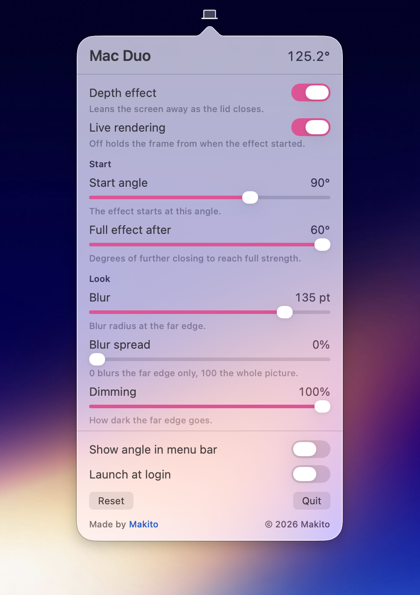

<div align="center">

# Mac Fold

**A lid-angle-driven desktop fold effect for compatible MacBooks.**

Close the lid below 90° to project your live built-in display into a Metal-rendered fold effect. The overlay reverses as the lid opens and ends at 90°.

**Available in:** English and Simplified Chinese (简体中文).



</div>

## Features

- **Metal rendering:** GPU perspective, blur, and dimming while the lid closes.
- **Live screen content:** ScreenCaptureKit mirrors the built-in display in real time.
- **Adjustable perspective:** Tune the visual depth to suit your viewing position.
- **90° threshold:** No effect above 90°; the effect starts below 90° when closing and stops at 90° when opening.

## Build

Requires macOS 14 or later, Xcode with Swift 6.0 or later, and a compatible MacBook lid-angle sensor.

```sh
./build.sh
./build.sh --run
```

The script creates `build/Mac Fold.app` with an ad-hoc signature. Grant Screen Recording permission when macOS asks.

## Known limitations

- Only compatible MacBooks with a readable internal lid-angle sensor can use the live effect.
- The effect applies only to the built-in display.
- The effect stops when macOS puts the MacBook to sleep near full closure.
- Clicks pass through the overlay to underlying apps.

## License and attribution

Mac Fold is distributed under the [Apache License 2.0](LICENSE). Required upstream attribution remains in [NOTICE](NOTICE).
