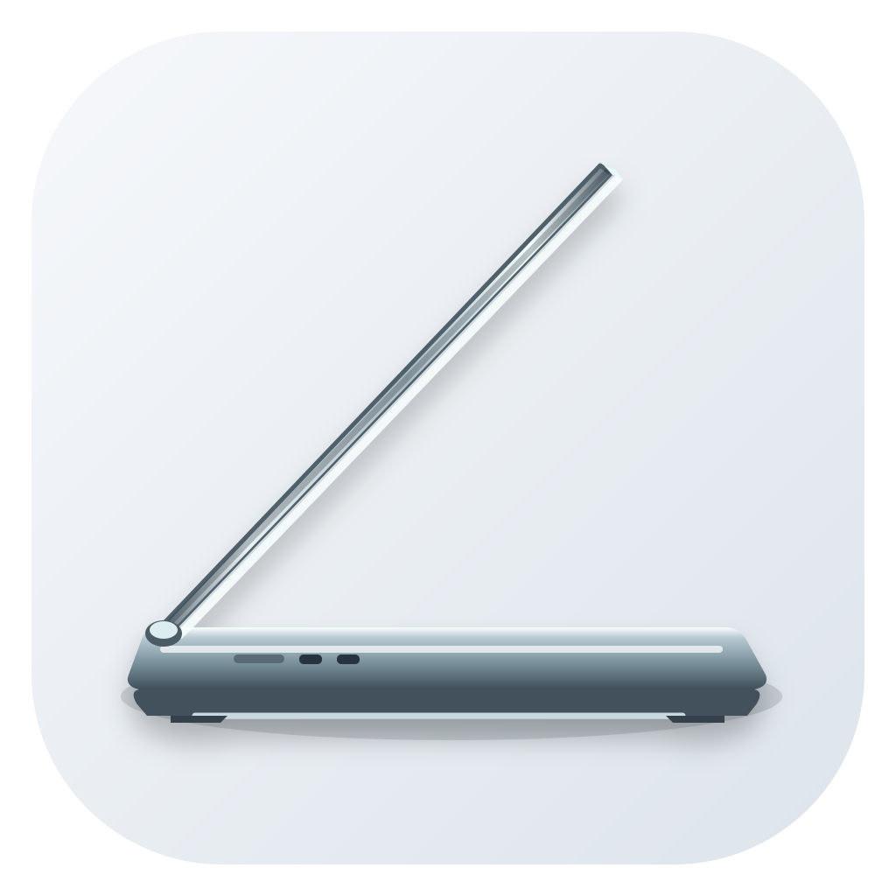

<div align="center">



# Mac Fold

**A lid-angle-driven desktop fold effect for compatible MacBooks.**

[](https://github.com/satyalayatinasish-arch/Mac-Fold/releases/latest)
[](https://www.apple.com/macos/)
[](https://github.com/satyalayatinasish-arch/Mac-Fold/releases/latest)
[](https://swift.org)
[](LICENSE)

Close the lid below 90° to project your live built-in display into a Metal-rendered fold effect. As the lid unfolds, the screen returns flat and seamlessly ends at 90°.

[**All Releases**](https://github.com/satyalayatinasish-arch/Mac-Fold/releases) &nbsp;•&nbsp; [**Report an Issue**](https://github.com/satyalayatinasish-arch/Mac-Fold/issues)

<br>

</div>

---

## Overview

Mac Fold is a lightweight macOS menu bar utility designed for MacBooks equipped with an internal lid-angle sensor. When you physically fold your MacBook's display below 90°, Mac Fold captures your live desktop and projects it onto a GPU-accelerated 3D perspective fold overlay. The content appears to remain spatially upright while your physical lid closes downward.

* **Available in:** English and Simplified Chinese (简体中文).

---

## Key Features

- **Metal-Accelerated 3D Perspective**: Smooth GPU-rendered fold geometry with realistic depth projection, dynamic blur gradients, and progressive dimming.
- **View-Based Fold Geometry**: Tune eye height and keyboard-base tilt so the perspective responds to where you are viewing the MacBook from, not only to hinge travel.
- **Real-Time Desktop Mirroring**: High-performance display capture via `ScreenCaptureKit` at 30 fps. Mac Fold automatically excludes its own windows to eliminate visual recursion loops.
- **Strict 90° Boundary Threshold**:
  - **At or above 90°**: No overlay or visual effect is shown.
  - **Closing below 90°**: Begins only upon deliberate closing movement (prevents accidental triggers while stationary).
  - **Opening to 90°**: The screen smoothly unrolls flat and completely dismisses at exactly 90° (`hysteresis = 0`).
- **Apple Hardware Hinge Sensor**: Direct IOKit HID integration (`0x05AC`, usage page `0x20`, usage `0x8A`) supporting Feature Report 7 (0.01° hundredths-of-a-degree precision) and Feature Report 1 (integer precision).
- **Zero-Lag Motion Prediction**: Sensor velocity tracking anticipates rapid closing gestures, eliminating perceptible visual latency.
- **Native macOS Settings**:
  - Accessible via the menu bar popover or standard <kbd>⌘</kbd> <kbd>,</kbd> Settings window.
  - The menu-bar popover keeps the essential controls close at hand: enable/live toggles, an animated hinge view, Eye Height, Base Tilt, and a fold preview.
  - The full Settings window provides fold threshold, blur span, blur radius, dimming reach, viewing distance, perspective recession, and idle timeout.
  - Optional live lid-angle display directly in the macOS menu bar.
- **Click-Through & Non-Intrusive**: The overlay window is borderless, non-activating, and passes all mouse clicks through to background apps.
- **Built-In Diagnostic CLI (`lidprobe`)**: Inspect hardware sensor availability, live angle streaming, refresh rates, and event logs.

---

## Installation

### Pre-Built DMG

1. Download the latest release from [**GitHub Releases**](https://github.com/satyalayatinasish-arch/Mac-Fold/releases).
2. Open the disk image and drag **Mac Fold** to your `/Applications` folder.
3. Launch **Mac Fold** from `/Applications` or Spotlight.
4. **Grant Permissions**: When prompted, grant **Screen Recording** permission in:
   > **System Settings** → **Privacy & Security** → **Screen & System Audio Recording** → enable **Mac Fold**.  
   *(Required for ScreenCaptureKit to mirror desktop content in real time).*

> [!NOTE]
> If macOS displays an unidentified developer warning on first launch, right-click (or Control-click) **Mac Fold.app** in Finder and select **Open**.

---

## Usage & Shortcuts

| Action | Shortcut / Gesture |
|---|---|
| **Open Settings Window** | Press <kbd>⌘</kbd> <kbd>,</kbd> while Mac Fold is active |
| **Quit Mac Fold** | Press <kbd>⌘</kbd> <kbd>Q</kbd> |
| **Menu Bar Quick Controls** | Click the Mac Fold icon in the menu bar |
| **View-Based Perspective** | Adjust Eye Height and Base Tilt in the menu-bar popover or Settings |
| **Trigger Fold Effect** | Deliberately close the MacBook display below 90° |
| **Dismiss Fold Effect** | Open the lid back to 90° |

### View-Based Perspective

In the **menu-bar popover** or **Settings → Observer Position**, use **Eye Height** to describe how far your eyes are above the screen centre and **Base Tilt** when the keyboard deck is not flat on a desk. These controls adjust only the perspective projection after the fold begins; they do not move the strict 90° start/stop boundary.

> The popover screenshot is intentionally omitted until it can be recaptured from the current app. The prior image did not show the new observer controls and would have been misleading.

---

## Building from Source

### Prerequisites

- macOS 14.0 (Sonoma) or later
- Xcode 16.0+ or Command Line Tools with Swift 6.0+
- A compatible MacBook with Apple Silicon or Intel processor

### Build Commands

Clone the repository and run the build script from the repository root:

```sh
git clone https://github.com/satyalayatinasish-arch/Mac-Fold.git
cd Mac-Fold

# Standard release build (ad-hoc signed)
./build.sh

# Build, sign, and immediately run/reload
./build.sh --run

# Universal binary build (Apple Silicon arm64 + Intel x86_64)
./build.sh --universal
```

The output application bundle is generated at `build/Mac Fold.app` and the diagnostic tool at `build/lidprobe`.

---

## Hardware Diagnostics (`lidprobe`)

Mac Fold includes a command-line tool, `lidprobe`, to inspect and debug the internal lid-angle sensor:

```sh
# Stream the current lid angle at 30 Hz (press Ctrl+C to stop)
./build/lidprobe

# Measure the effective hardware sensor refresh rate
./build/lidprobe rate

# Record reads for 30 seconds with millisecond timestamps
./build/lidprobe record 30

# Watch for rapid closing movements and measure angle steps
./build/lidprobe watch 15
```

If your MacBook possesses a supported sensor, `lidprobe` will report:
```text
sensor found: report 7 (0.01°)
streaming at 30 Hz, press ctrl-c to stop
 134.93°
 134.90°
 ...
```

---

## System Compatibility & Known Limitations

- **Hardware**: Compatible Apple Silicon MacBooks (M1/M2/M3/M4 MacBook Pro & MacBook Air) and select Intel MacBooks with internal hinge angle sensors.
- **Display**: The fold effect applies exclusively to the **built-in MacBook display** (external monitors remain unaffected).
- **Lid Sleep**: Near complete closure (under ~5°–10°), macOS triggers hardware clamshell sleep, which suspends display rendering.
- **Click-Through**: All mouse and trackpad events pass through the overlay to underlying windows and applications.

---

## License & Attribution

Distributed under the [Apache License 2.0](LICENSE).  
Required upstream attribution and history are preserved in [NOTICE](NOTICE).
